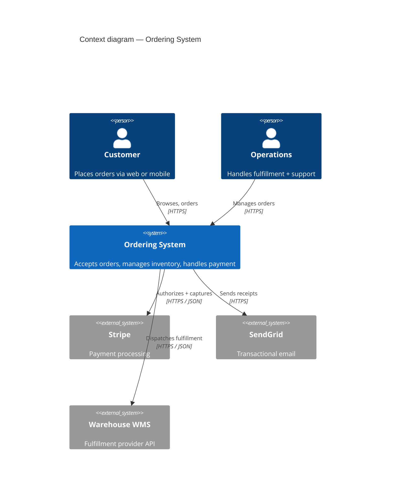
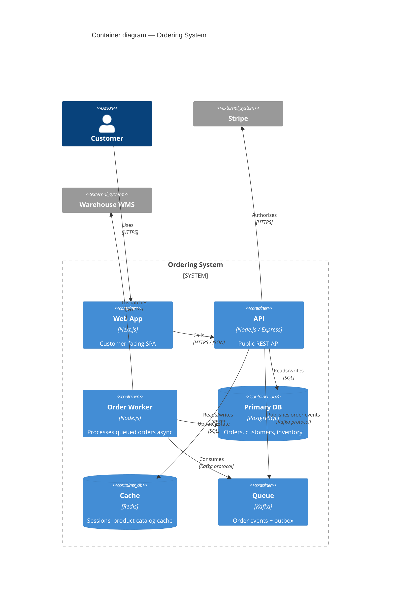

# Mermaid C4 — Ordering System

A compact C4 context + container example rendered in Mermaid. Paste into any Mermaid-capable renderer.

## Context diagram

## Container diagram

## Notes

- C4 support in Mermaid is newer — test rendering before relying on it in a presentation
- Keep **Context** to < 10 boxes; **Container** to < 15
- Always label edges with the protocol / synchrony — this is where most design mistakes hide
- For **Component** and **Code** levels, prefer a second diagram rather than cramming everything into one
