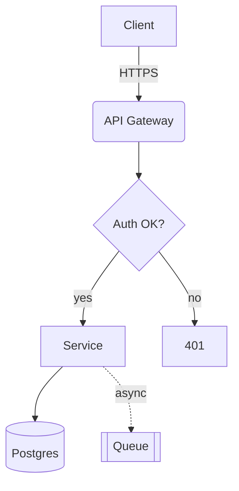
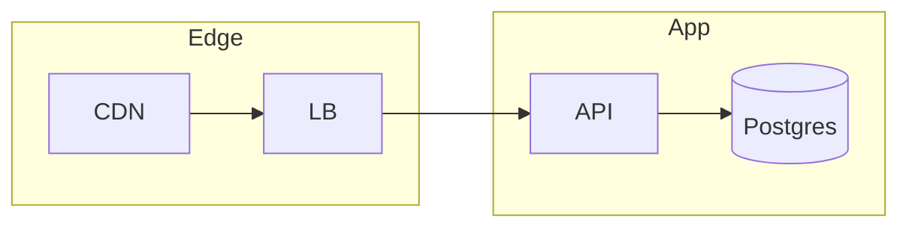
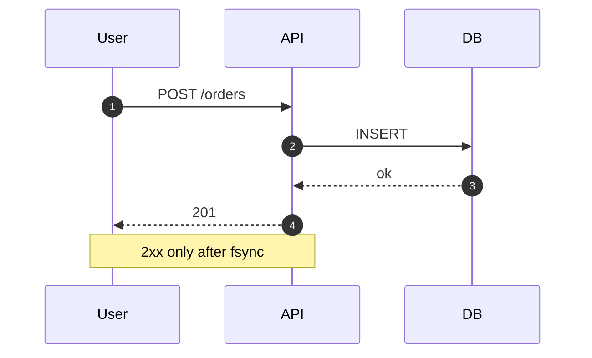
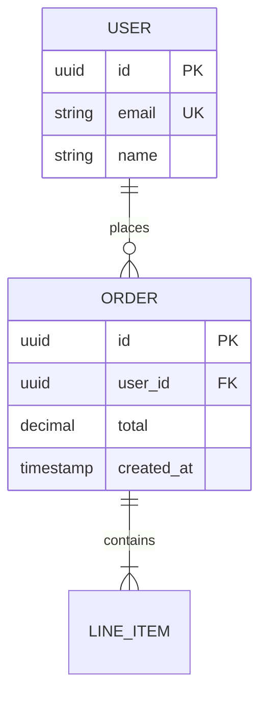
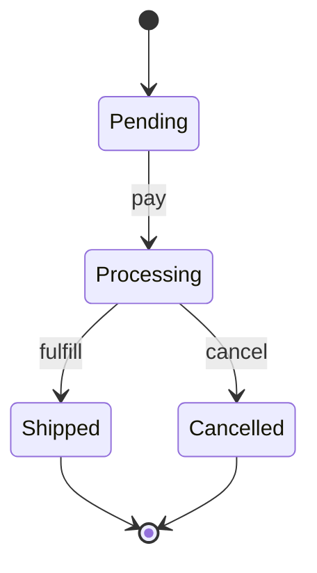
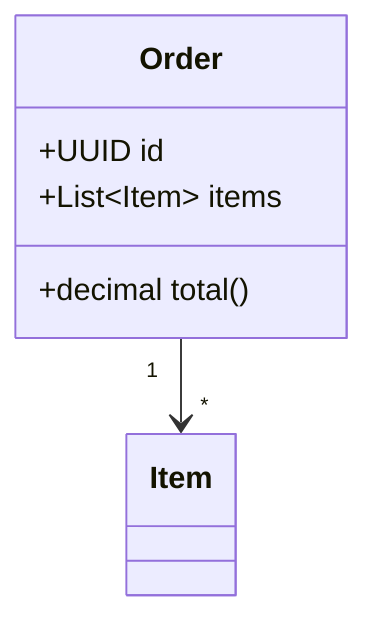
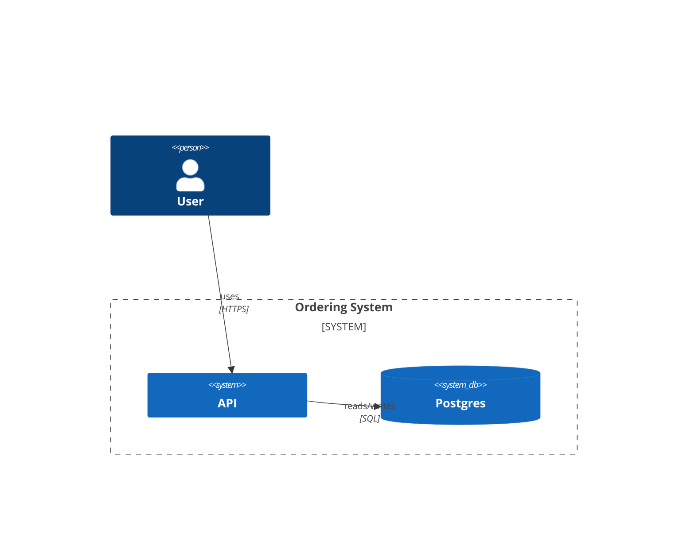

# Mermaid Cheat Sheet

Reference: https://mermaid.js.org/intro/

Mermaid renders in Markdown on GitHub, GitLab, Notion, Obsidian, Claude Code's own markdown, and more.

## Flowchart / graph

- Directions: `TD` top-down, `LR` left-right, `BT`, `RL`
- Shapes:
  - `A[Rectangle]`
  - `A(Rounded)`
  - `A([Stadium])`
  - `A[[Subroutine]]` (queues, repeated work)
  - `A[(Cylinder)]` (databases)
  - `A((Circle))` (endpoints)
  - `A{Diamond}` (decision)
  - `A>Flag]` (event)
- Arrows:
  - `-->` solid
  - `-.->` dashed (async)
  - `==>` thick (critical path)
  - `-->|label|` edge label
  - `-- label -->` alternative

### Subgraphs

## Sequence diagram

- `->>` request, `-->>` response
- `-x` error, `-->)` async
- `Note over`, `loop`, `alt`, `opt`, `par`

## ER diagram (relational schema)

Cardinality: `||--o{` one-to-many, `||--||` one-to-one, `}o--o{` many-to-many.

For richer ER (indexes, notes, refs) prefer DBML.

## State diagram

## Class diagram

## C4 (context / container / component)

Mermaid 10+ supports C4 via `C4Context`. It's a newer feature; check rendering first.

## Tips

- Use labels on EVERY edge. Unlabeled arrows hide the protocol and purpose.
- Use consistent shapes for consistent roles (always `[(...)]` for DBs, `[[...]]` for queues).
- Limit to ~15 nodes. Split larger diagrams into overview + detail.
- Use dashed edges for async, solid for sync.
- Group related components with `subgraph`.
- Avoid deep nesting (>2 levels); Mermaid renders awkwardly.

## Gotchas

- Mermaid is whitespace-sensitive in some contexts; spaces in labels may need quotes
- Node IDs can't contain spaces; use `A[Label with spaces]` instead
- HTML entities in labels: use `&lt;`, `&gt;`, `&amp;`
- Long labels wrap poorly; shorten or break into multiple nodes
